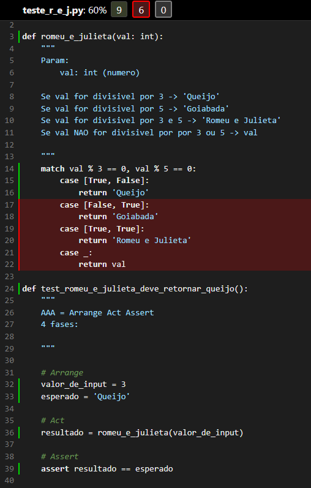
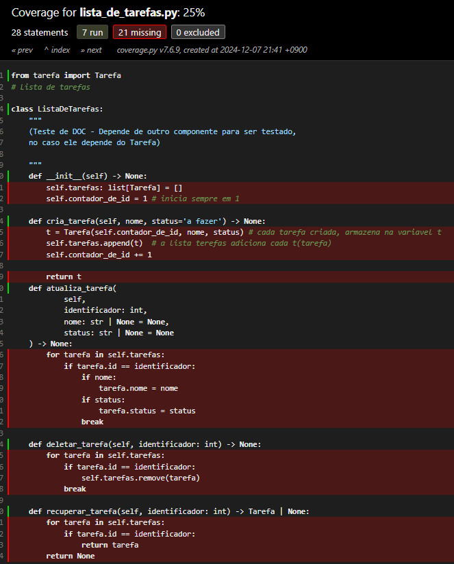
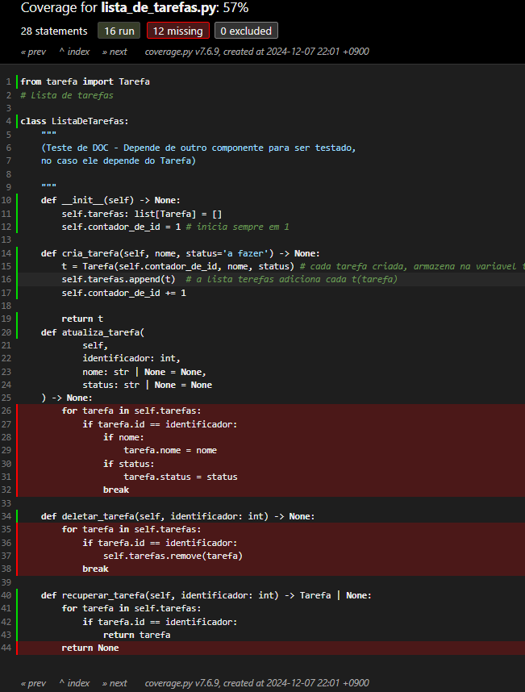
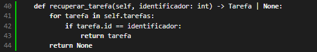
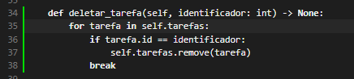
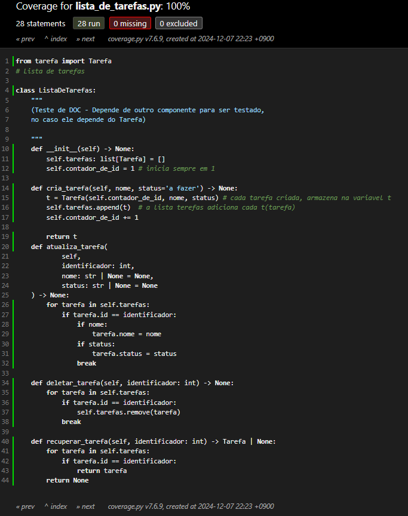

# FizzBuzz  

### Param:
###    val: int (numero)

### Se val for multiplo de 3 -> 'Queijo'
### Se val for multiplo de 5 -> 'Goiabada'
### Se val for multiplo de 3 e 5 -> 'Romeu e Julieta'
### Se val NAO for multiplo de 3 e 5 -> val

## Metodologia TDD  

O que é TDD?
TDD (Test-Driven Development) é uma metodologia de desenvolvimento que segue um ciclo rigoroso:

- RED: Escreva um teste que falha: Comece escrevendo um teste unitário baseado no requisito esperado (mas o código ainda não existe).
- GREEN: Implemente o código: Escreva o mínimo de código necessário para fazer o teste passar.
- REFACTOR: Melhore o código sem alterar o comportamento.


## Taxionomia dos testes  

O que é AAA?
AAA é um padrão amplamente usado para estruturar testes unitários. Ele divide um teste em três fases claras:

- ARRANGE (Preparar)
Configure o cenário de teste. Inicialize objetos, defina dependências, e prepare os dados necessários.  
    valor_de_input = 3  
    esperado = 'Queijo'

- ACT (Agir)
Execute o comportamento ou ação que está sendo testada.  
    resultado = romeu_e_julieta(valor_de_input)

- ASSERT (Verificar)
Verifique se os resultados obtidos estão de acordo com o esperado.  
    assert resutado == esperado

- TEARDOWN
Quando usar o Teardown?
Você só precisa da quarta fase (Teardown) quando o teste pode:

    - Criar efeitos colaterais que afetam outros testes.  
    - Consumir recursos externos, como arquivos, conexões de banco de dados, ou APIs.  
    - Usar mocks ou spies que devem ser limpos após o teste.  

## Conexão entre AAA e TDD  

AAA é usado dentro do ciclo TDD para estruturar os testes.
Quando você escreve testes no TDD, o padrão AAA ajuda a organizá-los de forma clara e compreensível.

TDD depende de bons testes, e AAA fornece uma base sólida para isso.
Com AAA, os testes ficam mais legíveis e intuitivos, o que é crucial para a prática de TDD.

## Instalacoes 

Use o comando `python -m venv venv` para criar um ambiente virtual.  
Intale as ferramentas para teste e coverage: `pip install pytest pytest-cov`  
Atualize o pip, caso necessario: `python.exe -m pip install --upgrade pip`  

### Codificacao:
```
def romeu_e_julieta(val: int): 

def test_romeu_e_julieta_deve_retornar_queijo():  
 # Arrange
    valor_de_input = 3
    esperado = 'Queijo'

# Act
    resultado = romeu_e_julieta(valor_de_input)

# Assert
    assert resultado == esperado
```
## Teste de COMPORTAMENTO

1- Rode o pytest no arquivo: `pytest teste_r_e_j.py`  

``` 
MSG DE ERRO (None == 'Queijo'/ nao ouve implentacao na funcao)
E       AssertionError: assert None == 'Queijo'

teste_r_e_j.py:29: AssertionError
=================== short test summary info ===================
FAILED teste_r_e_j.py::test_romeu_e_julieta_deve_retornar_queijo  
- AssertionError: assert None == 'Queijo'
====================== 1 failed in 0.15s ======================
```

### Implentacao na funcao principal
```
def romeu_e_julieta(val: int): 
    match val % 3 == 0, val % 5 == 0:
        case [True, False]:
            return 'Queijo'
        case [False, True]:
            return 'Goiabada'
        case [True, True]:
            return 'Romeu e Julieta'
        case _:
            return val

def test_romeu_e_julieta_deve_retornar_queijo():  
    valor_de_input = 3
    esperado = 'Queijo'

    resultado = romeu_e_julieta(valor_de_input)

    assert resultado == esperado

```

2- Rode o pytest no arquivo: `pytest teste_r_e_j.py -v`  
```
============================== test session starts ===============================
platform win32 -- Python 3.12.5, pytest-8.3.4, pluggy-1.5.0
rootdir: C:\Users\miyuk\pythonProject\TestesPython
plugins: cov-6.0.0
collected 1 item

teste_r_e_j.py::test_romeu_e_julieta_deve_retornar_queijo PASSED           [100%]

=============================== 1 passed in 0.08s =================================
```

Agora vamos melhorar os testes com o coverage que passa por cada case.
Execute: `pytest teste_r_e_j.py -v --cov=teste_r_e_j`

```
teste_r_e_j.py::test_romeu_e_julieta_deve_retornar_queijo PASSED                                    [100%]

---------- coverage: platform win32, python 3.12.5-final-0 -----------
Name             Stmts   Miss  Cover
------------------------------------
teste_r_e_j.py      15      6    60%
------------------------------------
TOTAL               15      6    60%


================================= 1 passed in 0.13s ==============================
```

Criando o coverage no HTML: `coverage html`

Abra a pag index.html e clique no file teste_r_e_j.py



Iniciando o case 2:
```
def test_romeu_e_julieta_deve_retornar_goiabada():
    valor_de_input = 5
    esperado = 'Goiabada'

    resultado = romeu_e_julieta(valor_de_input)

    assert resultado == esperado
```


```
===================== test session starts =====================
platform win32 -- Python 3.12.5, pytest-8.3.4, pluggy-1.5.0 -- C:\Users\miyuk\pythonProject\TestesPython\venv\Scripts\python.exe
cachedir: .pytest_cache

teste_r_e_j.py::test_romeu_e_julieta_deve_retornar_queijo PASSED [ 50%]
teste_r_e_j.py::test_romeu_e_julieta_deve_retornar_goiabada PASSED [100%]

---------- coverage: platform win32, python 3.12.5-final-0 -----------
Name             Stmts   Miss  Cover
------------------------------------
teste_r_e_j.py      11      0   100%
------------------------------------
TOTAL               11      0   100%


====================== 2 passed in 0.14s ======================
```
teste do case 3:

```
def test_romeu_e_julieta_deve_retornar_ReJ():
    valor_de_input = 15  # este valor e multiplo de 3 e 5 ao mesmo tempo como e esperado na funcao
    esperado = 'Romeu e Julieta'

    resultado = romeu_e_julieta(valor_de_input)

    assert resultado == esperado
```

```
========================== test session starts ==========================

platform win32 -- Python 3.12.5, pytest-8.3.4, pluggy-1.5.0 -- C:\Users\miyuk\pythonProject\TestesPython\venv\Scripts\python.exe
cachedir: .pytest_cache
rootdir: C:\Users\miyuk\pythonProject\TestesPython
plugins: cov-6.0.0
collected 3 items

teste_r_e_j.py::test_romeu_e_julieta_deve_retornar_queijo PASSED                        [ 33%] 
teste_r_e_j.py::test_romeu_e_julieta_deve_retornar_goiabada PASSED                      [ 66%] 
teste_r_e_j.py::test_romeu_e_julieta_deve_retornar_ReJ PASSED                           [100%]

---------- coverage: platform win32, python 3.12.5-final-0 -----------
Name             Stmts   Miss  Cover
------------------------------------
teste_r_e_j.py      16      0   100%
------------------------------------
TOTAL               16      0   100%


=========================== 3 passed in 0.14s ===========================
```

Ultimo teste:
```
def test_romeu_e_julieta_deve_retornar_val():
    valor_de_input = 1  # este valor nao e multiplo de 3 nem 5 como e esperado na funcao
    esperado = 1

    resultado = romeu_e_julieta(valor_de_input)

    assert resultado == esperado
```

```
==================================== test session starts =====================================
platform win32 -- Python 3.12.5, pytest-8.3.4, pluggy-1.5.0 -- C:\Users\miyuk\pythonProject\TestesPython\venv\Scripts\python.exe
cachedir: .pytest_cache
rootdir: C:\Users\miyuk\pythonProject\TestesPython
plugins: cov-6.0.0
collected 4 items

teste_r_e_j.py::test_romeu_e_julieta_deve_retornar_queijo PASSED                        [ 25%] 
teste_r_e_j.py::test_romeu_e_julieta_deve_retornar_goiabada PASSED                      [ 50%] 
teste_r_e_j.py::test_romeu_e_julieta_deve_retornar_ReJ PASSED                           [ 75%] 
teste_r_e_j.py::test_romeu_e_julieta_deve_retornar_val PASSED                           [100%] 

---------- coverage: platform win32, python 3.12.5-final-0 -----------
Name             Stmts   Miss  Cover
------------------------------------
teste_r_e_j.py      21      0   100%
------------------------------------
TOTAL               21      0   100%


========================== 4 passed in 0.14s =========================
```

## Teste de SCHEMA(Validacao)
```
Todo List

from dataclasses import dataclass

@dataclass
class Tarefa:
    id: int
    nome: str
    status: str = 'a fazer'
```  

Rodando o teste: `pytest teste_tarefa.py -v --cov=teste_tarefa`  

```
===================== test session starts =====================
platform win32 -- Python 3.12.5, pytest-8.3.4, pluggy-1.5.0 -- C:\Users\miyuk\pythonProject\TestesPython\venv\Scripts\python.exe
cachedir: .pytest_cache
rootdir: C:\Users\miyuk\pythonProject\TestesPython
plugins: cov-6.0.0
collected 1 item

teste_tarefa.py::teste_Tarefa_deve_conter_os_campos_id_nome_status PASSED [100%]

---------- coverage: platform win32, python 3.12.5-final-0 -----------
Name              Stmts   Miss  Cover
-------------------------------------
teste_tarefa.py       9      0   100%
-------------------------------------
TOTAL                 9      0   100%


====================== 1 passed in 0.15s ====================== 
```

## Teste de DOC
```
from tarefa import Tarefa
Lista de tarefas 

class ListaDeTarefas:
    """
    (Teste de DOC - Depende de outro componente para ser testado, 
    no caso ele depende do Tarefa)

    """
    def __init__(self) -> None:
        self.tarefas: list[Tarefa] = []
        self.contador_de_id = 1 # inicia sempre em 1

    def cria_tarefa(self, nome, status='a fazer') -> None:
        t = Tarefa(self.contador_de_id, nome, status) # cada tarefa criada, armazena na variavel t
        self.tarefas.append(t)  # a lista terefas adiciona cada t(tarefa)
        self.contador_de_id += 1

        return t
    def atualiza_tarefa(
            self,
            identificador: int,
            nome: str | None = None,
            status: str | None = None
    ) -> None:
        for tarefa in self.tarefas:
            if tarefa.id == identificador:
                if nome:
                    tarefa.nome = nome
                if status:
                    tarefa.status = status
                break

    def deletar_tarefa(self, identificador: int) -> None:
        for tarefa in self.tarefas:
            if tarefa.id == identificador:
                self.tarefas.remove(tarefa)
            break
    
    def recuperar_tarefa(self, identificador: int) -> Tarefa | None:
        for tarefa in self.tarefas:
            if tarefa.id == identificador:
                return tarefa
        return None
```

`pytest teste_lista_tarefas.py -v --cov=lista_de_tarefas`

```
==================== test session starts =====================
platform win32 -- Python 3.12.5, pytest-8.3.4, pluggy-1.5.0 -- C:\Users\miyuk\pythonProject\TestesPython\venv\Scripts\python.exe
cachedir: .pytest_cache
rootdir: C:\Users\miyuk\pythonProject\TestesPython
plugins: cov-6.0.0
collected 0 items


---------- coverage: platform win32, python 3.12.5-final-0 -----------
Name                  Stmts   Miss  Cover
-----------------------------------------
lista_de_tarefas.py      28     21    25%
-----------------------------------------
TOTAL                    28     21    25%

==================== no tests ran in 0.11s ====================
```


`pytest teste_lista_tarefas.py -v --cov=lista_de_tarefas`

```
from lista_de_tarefas import ListaDeTarefas

def teste_lista_de_tarefas_criar_tarefas():
    # Arrange
    ldt = ListaDeTarefas()
    nome = 'test'

    # Act
    t = ldt.cria_tarefa(nome)

    # Assert
    assert ldt.recuperar_tarefa(t.id)
    assert t.nome == nome
    assert t.status == 'a fazer'
```



```
def teste_lista_de_tarefas_recuperar_tarefa():
    ldt = ListaDeTarefas()

    # garante q veio None
    assert not ldt.recuperar_tarefa(10)
```



```
from tarefa import Tarefa
from lista_de_tarefas import ListaDeTarefas

def teste_lista_de_tarefas_deletar_tarefa():
    # Arrange: Configura os objetos iniciais
    lista = ListaDeTarefas()
    tarefa1 = lista.cria_tarefa("Tarefa 1")
    tarefa2 = lista.cria_tarefa("Tarefa 2")
    
    assert len(lista.tarefas) == 2  # Garantir que temos duas tarefas inicialmente
    
    # Act: Executa o método a ser testado
    lista.deletar_tarefa(tarefa1.id)
    
    # Assert: Verifica os resultados
    assert len(lista.tarefas) == 1  # Deve sobrar apenas uma tarefa
    assert lista.recuperar_tarefa(tarefa1.id) is None  # A tarefa deletada não deve existir
    assert lista.recuperar_tarefa(tarefa2.id) is not None  # A tarefa restante deve existir
```


```
from tarefa import Tarefa
from lista_de_tarefas import ListaDeTarefas

def test_atualiza_tarefa():
    # Arrange: Configuração inicial
    lista = ListaDeTarefas()
    tarefa1 = lista.cria_tarefa("Tarefa Inicial", "a fazer")

    # Garantir que a tarefa foi criada corretamente
    assert tarefa1.nome == "Tarefa Inicial"
    assert tarefa1.status == "a fazer"

    # Act: Atualizar o nome e status da tarefa
    lista.atualiza_tarefa(tarefa1.id, nome="Tarefa Atualizada", status="concluído")

    # Assert: Verificar se a tarefa foi atualizada
    tarefa_atualizada = lista.recuperar_tarefa(tarefa1.id)
    assert tarefa_atualizada is not None
    assert tarefa_atualizada.nome == "Tarefa Atualizada"
    assert tarefa_atualizada.status == "concluído"
```

```
==================================== test session starts =====================================
platform win32 -- Python 3.12.5, pytest-8.3.4, pluggy-1.5.0 -- C:\Users\miyuk\pythonProject\TestesPython\venv\Scripts\python.exe
cachedir: .pytest_cache
rootdir: C:\Users\miyuk\pythonProject\TestesPython
plugins: cov-6.0.0
collected 4 items

teste_lista_tarefas.py::teste_lista_de_tarefas_criar_tarefas PASSED                     [ 25%] 
teste_lista_tarefas.py::teste_lista_de_tarefas_recuperar_tarefa PASSED                  [ 50%]
teste_lista_tarefas.py::teste_lista_de_tarefas_deletar_tarefa PASSED                    [ 75%] 
teste_lista_tarefas.py::test_atualiza_tarefa PASSED                                     [100%] 

---------- coverage: platform win32, python 3.12.5-final-0 -----------
Name                  Stmts   Miss  Cover
-----------------------------------------
lista_de_tarefas.py      28      0   100%
-----------------------------------------
TOTAL                    28      0   100%


===================================== 4 passed in 0.29s ======================================
```
